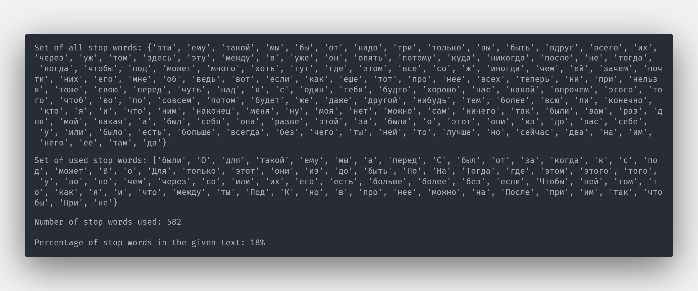

# Theme - cleaning text from noise words

## Exercise
1. Remove stop words from *.docx(source - text.docx) and present the processed text (Surname_stage1.doc).
2. Show a stop-word dictionary for the given text.
3. Show the percentage of stop words in the given text.

## How to use
1. Create virtual environment
2. Activate virtual environment
3. Install dependencies from `requirements.txt`
4. Run `main.py`
5. Open `*.docx`
5. Copy text from `*.docx` and paste to [link](https://pr-cy.ru/zypfa/text).
6. Copy first 21 lines and change property initial data to `__frequent_words` in the method `text_processing.text_cleaner.TextCleaner.export_last_paragraphs_words_frequency_to_xlsx`.
7. Remove comments from `application.TextCleaner.run` line  of code which consist of `self.__text_cleaner.export_last_paragraphs_words_frequency_to_xlsx()`
8. Run `main.py` again.
9. Open `*.xlsx`

## Output

